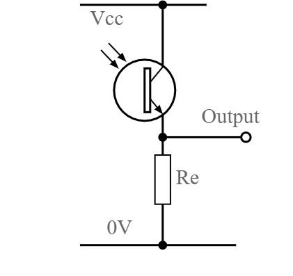

### RC car battle tanks

# Who
  - Simon Mestdagh
  - Jens Cocquyt
  - Lukas Hoste
  - Nick Geysen
# Why
  - Shooting targets adds a challenge to the race
# Main goal
  - Battle tank -> A weapon that shoots a laser is attatched to the tank to shoot at targets.
  - Race with targets -> A race with targets along the track to shoot down. You either get points per target shot down or need to shoot down all targets to win.  
  - Controller -> Abbility to control the car with a controller
# Technology
  - Arduino with infrared sensors to detect the car at checkpoints, start and finish
  - Arduino also detects with laser reciever when target is shot
# Extra's
  - speedometer
  - distance meter
# Wie
  - Jens Cocquyt and Nick  Geysen: weapon and target on car
  - Lukas Hoste and Simon Mestdagh: Checkpoints, controller, track

# Setup

## Materiaal

* Lego rc-tank
* Sbrick
* 1 esp32 per target
* 1 phototransistor per target https://www.vishay.com/docs/81504/bpv11.pdf
* 4 infrarood leds http://www.farnell.com/datasheets/2861612.pdf

## Werking

De 4 leds worden in serie geplaatst. Deze worden aan de hand van een in twee geknipte kabel aan een kanaal van de sbrick bevestigd.

De target wordt opgebouwd aan de hand van het onderstaande schema. De waarde van de gebruikte weerstand is 39K en de output werd met een GPIO pin verbonden. Op deze arduino moet het programma esp8266.ino geplaatst worden. Indien er een andere GPIO pin gebruikt wordt moet de waarde van photoTran aangepast worden. Belangrijk is dat de naam van de wifi en het passwoord in dit programma moet aangepast worden. Ook moet de URL van de api aangepast worden.

Voor de interface wordt local host gebruikt. 
De controller kan dan verbonden worden met bluetooth of usb en zal direct werken.
  
# Sources

https://www.behance.net/gallery/45242975/SBRICK-WEB-CONTROLLER
http://sbrick.360fun.net/

# Video
https://www.youtube.com/watch?v=J1ub0qlA3BU
